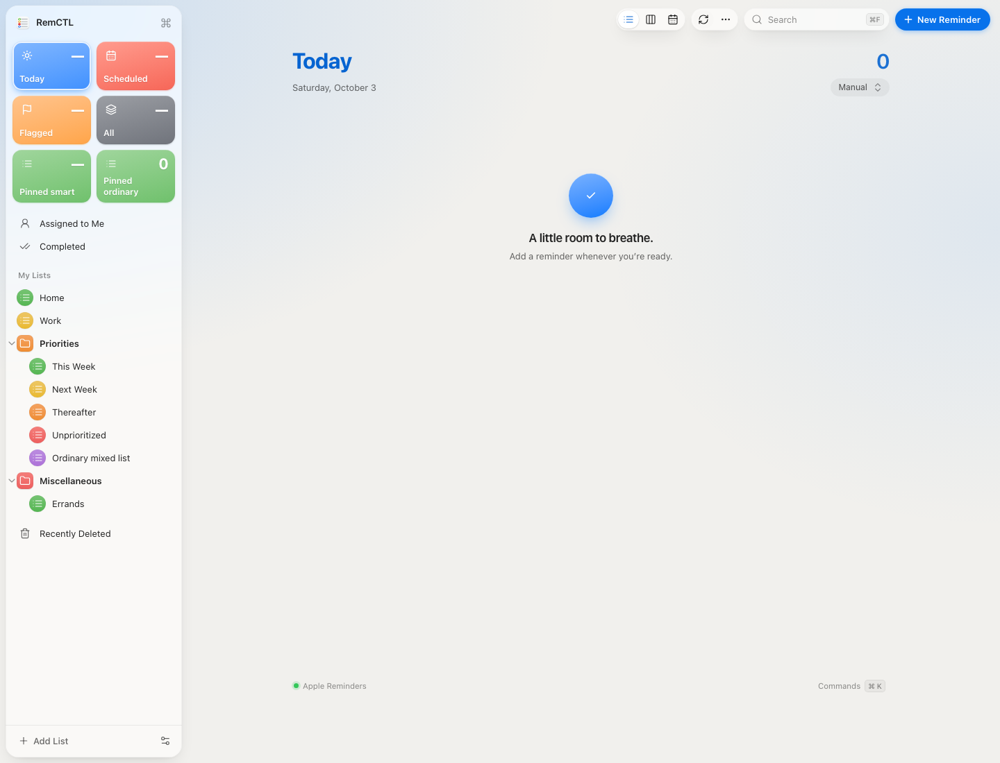

# Issues #57–#59 validation

Validated on October 3, 2026. Changes are on the local `fix/issues-57-59` branch. The installed RemCTL app has not been updated, and no release, pull request, issue comment, or remote branch was published.

## Changes

- [#57](https://github.com/viticci/remctl/issues/57): onboarding includes existing MCP/plugin connections even when the client's command is absent from PATH. Codex.app is detected in `/Applications` and `~/Applications`. A desktop installation without the command gets plugin setup guidance. The installation guide names the clients this step checks and explains that ChatGPT is outside it.
- [#58](https://github.com/viticci/remctl/issues/58): Smart List reads include either supported parent-folder column. The sidebar renders custom Smart Lists alongside ordinary lists inside their folders, with the correct navigation and pin actions. A missing folder falls back to the top level.
- [#59](https://github.com/viticci/remctl/issues/59): right-click menus offer Move Up, Move Down, and Reset Order for ordinary lists, folders, custom Smart Lists, and pinned tiles. Preferences are stored in the plugin's private `desktop/sidebar-order.json`, separately for the top level, each folder, and pinned tiles. Stable object identifiers preserve the preference across server restarts and UI updates. New items follow saved items, and removed identifiers are ignored. Ordering changes only RemCTL's display; automatic mirroring of Apple's sidebar order is not included.

## Verification

- `python3 -m unittest discover -s tests`: 882 tests, 876 passed and six optional distribution tests skipped, in 309.547 seconds. The suite includes isolated installer checks. It emitted existing SQLite resource and Pillow deprecation warnings.
- `npm run check`, `npm test`, and `npm run build` in `ui`: passed. These include TypeScript checks, interaction contracts, and official OpenAI extension schema checks. The generated workspace and plugin build fingerprint were refreshed.
- Browser acceptance used the actual generated workspace HTML, its MCP Apps message transport, and the real plugin preference tools with an isolated temporary config. Reminder reads used fixtures; no live reminders were changed.
- The browser reproduced Home → Miscellaneous → Priorities → Work, then used the menus to produce Home → Work → Priorities → Miscellaneous. Inside Priorities, it reordered custom Smart Lists to This Week → Next Week → Thereafter → Unprioritized alongside an ordinary list. Both orders survived refreshing and reopening the workspace.
- The browser also checked smart-list navigation, folder folding, pinned-tile ordering, disabled boundary controls, and resetting one folder without resetting the top level or pins. Ordering worked with advanced features disabled.
- `git diff --check`: passed. The pre-existing untracked `.playwright-mcp/` directory was preserved.

## Remaining acceptance

The fixes need installation and verification in the actual Codex desktop plugin before claiming installed acceptance. The browser fixture verifies rendering and preference persistence, not the reporter's live Reminders data or a released build.
